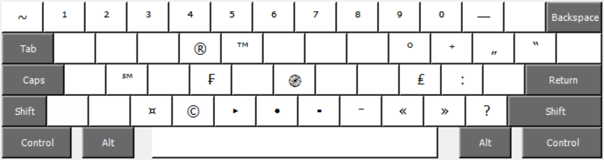

## «Armenian Mnemonic R» Keyman ստեղնաշարը

&nbsp;&nbsp;&nbsp;&nbsp;«Armenian Mnemonic R» ստեղնաշարը հնարավոր է [տեղադրել](#տեղադրումը) Keyman հարթակի վրա։ [Keyman](https://keyman.com/about/)-ը անվճար ու բաց կոդով ստեղնաշարի հարթակ է և հասանելի է հայտնի ՕՀ-երի համար, այդ թվում՝ [Windows](https://keyman.com/windows/)-ի, [macOS](https://keyman.com/mac/)-ի, [Linux](https://keyman.com/linux/)-ի, [Android](https://keyman.com/android/)-ի, [iOS](https://keyman.com/iphone-and-ipad/)-ի, և նաև [Վեբի](https://keymanweb.com/) համար:  
&nbsp;&nbsp;&nbsp;&nbsp;Այս ստեղնաշարը [«Armenian Mnemonic»](https://github.com/dotland/mnemonic-kb-hy/blob/main/README.md) ստեղնաշարից տարբերվում է միայն `T` և `P` ստեղներով. այս ստեղնաշարի `T` ստեղնով մուտքագրվում է Տ տառը, իսկ `P` ստեղնով՝ Պ տառը։ Հայերեն տեքստի [վերլուծությունը](https://gist.github.com/dotland/2c0ce1a63804c2ea651b750cad3235b0) ցույց է տալիս, որ Տ և Պ տառերը հանդիպում են մոտ երկու անգամ ավելի հաճախ քան Թ և Փ տառերը։

&nbsp;&nbsp;&nbsp;&nbsp;Այս ստեղնաշարը պարունակում է 18 բաղադրյալ ստեղներ. `T` `t` `S` `s` `D` `d` `G` `g` `K` `k` `Z` `z` `C` `c` `'` `"` `\` `/`, որտեղ `T` նույնն է ինչ `Shift`+`t` զուգակցությունը կամ հենց `t` ստեղնը `Caps Lock` ստեղնը միացրած։ Սեղմեք այս բաղադրյալ ստեղներից մեկը, այնուհետև մեկ այլ ստեղն՝ ցանկալի արդյունքը ստանալու համար: Օրինակ՝ սեղմեք `T` և ապա `Բացատ`՝&nbsp; Տ տառը մուտքագրելու համար, սեղմեք `T` և այնուհետև `s`՝&nbsp; Ծ տառը մուտքագրելու համար: Ստորև պատկերված է բաղադրյալ ստեղների կոմբինացիաների աղյուսակները.  

|       | `Բացատ` |  `s`  |  `S`  |
| :---  |  :---:  | :---: | :---: |
| `t`   |   տ     |   ծ   |   ծ   |
| `T`   |   Տ     |   Ծ   |   Ծ   |

|       | `Բացատ` |  `z`  |  `Z`  |
| :---  |  :---:  | :---: | :---: |
| `d`   |   դ     |   ձ   |   ձ   |
| `D`   |   Դ     |   Ձ   |   Ձ   |

|       | `Բացատ` |  `h`  |  `H`  |
| :---  |  :---:  | :---: | :---: |
| `s`   |   ս     |   շ   |   շ   |
| `S`   |   Ս     |   Շ   |   Շ   |
| `g`   |   գ     |   ղ   |   ղ   |
| `G`   |   Գ     |   Ղ   |   Ղ   |
| `k`   |   կ     |   խ   |   խ   |
| `K`   |   Կ     |   Խ   |   Խ   |
| `z`   |   զ     |   ժ   |   ժ   |
| `Z`   |   Զ     |   Ժ   |   Ժ   |
| `c`   |   ց     |   չ   |   չ   |
| `C`   |   Ց     |   Չ   |   Չ   |

|       | `Բացատ` |  `w`  |  `W`  |  `e`  |  `E`  |  `r`  |  `R`  |  `t`  |  `T`  |  `p`  |  `P`  |  `j`  |  `J`  |  `c`  |  `C`  |  `<`  |  `>`  |  `[`  |  `]`  |  `-`  |  `,`  |  `.`  |  `/`  |  `o`  |  `O`  |
| :---  |  :---:  | :---: | :---: | :---: | :---: | :---: | :---: | :---: | :---: | :---: | :---: | :---: | :---: | :---: | :---: | :---: | :---: | :---: | :---: | :---: | :---: | :---: | :---: | :---: | :---: |
| `'`   |   '   |   և     |   և   |   է   |   Է   |   ռ   |   Ռ   |   թ   |   Թ   |   փ   |   Փ   |   ճ   |   Ճ   |   ծ   |   Ծ   |   ‹   |   ›   |   ‘   |   ’   |   ֊   |   ՚   |   ·   |   ՛   |   °   |   °   |

|       | `Բացատ` |  `w`  |  `W`  |  `e`  |  `E`  |  `r`  |  `R`  |  `t`  |  `T`  |  `p`  |  `P`  |  `j`  |  `J`  |  `c`  |  `C`  |  `<`  |  `>`  |  `[`  |  `]`  |
| :---  |  :---:  | :---: | :---: | :---: | :---: | :---: | :---: | :---: | :---: | :---: | :---: | :---: | :---: | :---: | :---: | :---: | :---: | :---: | :---: |
| `"`   |   "     |   և   |   և   |   Է   |   Է   |   Ռ   |   Ռ   |   Թ   |   Թ   |   Փ   |   Փ   |   Ճ   |   Ճ   |   Ծ   |   Ծ   |   «   |   »   |   “   |   ”   |

|       | `Բացատ` |  `-`  |  `=`  |  `+`  |  `/`  |  `x`  |  `8`  |  `*`  |  `T`  |  `L`  |  `E`  |  `V`  |  `A`  |  `O`  |  `B`  |  `U`  |  `C`  |  `<`  |  `>`  |  `[`  |  `]`  |  `{`  |  `}`  |
| :---  |  :---:  | :---: | :---: | :---: | :---: | :---: | :---: | :---: | :---: | :---: | :---: | :---: | :---: | :---: | :---: | :---: | :---: | :---: | :---: | :---: | :---: | :---: | :---: |
| `\`   |   \     |   −   |   ≡   |   ±   |   ÷   |   ×   |   ∞   |   ∗   |   ⟂   |   ∟   |   ∃  |   ∨  |   ∀  |   ∘   |   ∈  |   ∪  |   ⊂   |   ≤   |   ≥   |   〈   |   〉   |   ≺   |   ≻   |

|       | `Բացատ` |  `-`  |  `=`  |  `'`  |  `"`  |  `;`  |  `*`  |  `L`  |  `E`  |  `V`  |  `N`  |  `0`  |  `B`  |  `U`  |  `C`  |  `<`  |  `>`  |
| :---  |  :---:  | :---: | :---: | :---: | :---: | :---: | :---: | :---: | :---: | :---: | :---: | :---: | :---: | :---: | :---: | :---: | :---: |
| `/`   |   /     |   ՟   |   ≠   |   ′   |   ″   |   ‴   |   ⋆   |   ∠  |   ∄   |   ∧  |   ¬   |   ∅   |   ∉  |   ∩   |   ⊄  |   ↵  |   ↦   |

&nbsp;&nbsp;&nbsp;&nbsp;Հետևյալ նկարներում պատկերված է «Armenian Mnemonic R» ստեղնաշարը՝ տարբեր մոդիֆիկատոր-ստեղների սեղման վիճակում, որոնցում բաց մոխրագույնով նշված են բաղադրյալ ստեղները։

##### Նկ. 1. «Armenian Mnemonic R» ստեղնաշարը

##### Նկ. 2. «Armenian Mnemonic R» ստեղնաշարը `Caps Lock` ստեղնը միացրած

##### Նկ. 3. «Armenian Mnemonic R» ստեղնաշարը `Shift` ստեղնը սեղմած 

##### Նկ. 4. «Armenian Mnemonic R» ստեղնաշարը `AltGr` ստեղնը սեղմած

##### Նկ. 5. «Armenian Mnemonic R» ստեղնաշարը `AltGr`+`Shift` ստեղների զուգակցությամբ 

Windows և Linux ՕՀ-երում `AltGr` ստեղնը ([Alt Graph](https://en.wikipedia.org/wiki/AltGr_key)) աջ `Alt` ստեղն է, իսկ macOS ՕՀ-ում այդ ստեղնին համապատասխանում է `⌥` ստեղնը ([Option](https://en.wikipedia.org/wiki/Option_key))։ Ստեղնաշարի այլ նախագծերում, ինչպիսին են՝ «Armenian Phonetic» կամ «Armenian Typewriter», `AltGr` ստեղնով հնարավոր է մուտքագրել թվանշաններ, փակագծեր, շեղագծեր, իսկ `AltGr`+`Shift` ստեղների զուգակցությամբ՝ «US» ստեղնաշարի վրա գտնվող հատուկ սիմվոլները։

&nbsp;&nbsp;&nbsp;&nbsp;«Armenian Mnemonic R» հպաստեղնաշարը սմարթֆոնների համար ունի այլ տեսք, քանի որ այս դեպքում չկան մոդիֆիկատոր-ստեղներ.

&nbsp;&nbsp;&nbsp;&nbsp;&nbsp;&nbsp;&nbsp;&nbsp; 

 &nbsp;&nbsp;&nbsp;&nbsp;

Որոշ ստեղների վրա կա կետ՝ ստեղնի վերևի աջ անկյունում: Սեղմած պահելով այդպիսի ստեղնի վրա՝ կարելի է մուտքագրել այլ սիմվոլներ, տառեր, նշաններ: 

### Տեղադրումը

##### Windows, macOS, Linux

&nbsp;&nbsp;&nbsp;&nbsp;Տեղադրեք Keyman ծրագիրը [Windows](https://keyman.com/windows/), [macOS](https://keyman.com/mac/) կամ [Linux](https://keyman.com/linux/) ՕՀ-ի վրա: Մկնիկի աջ կոճակով սեղմելով՝ խնդրագոտու վրա գտնվող Keyman պատկերակը՝ անցեք «Կարգավորումներ» բաժինը ( `Configuration...` ): Այնուհետև սեղմեք `Install keyboard...` կոճակը, ընտրեք նախորոք ներբեռնած [hymr.kmp](https://github.com/dotland/mnemonic-kb-hy-r/releases/latest/download/hymr.kmp) ֆայլը և սեղմեք `Install` կոճակը: Հաջող տեղադրումից հետո վերագործարկեք ՕՀ-ը, որից հետո կարող եք ընտրել&nbsp; «Armenian Mnemonic R»  &nbsp;մուտքագրման լեզուն ձախ &nbsp;`Alt`+`Shift`&nbsp; կամ Windows ՕՀ-ում՝ &nbsp; + `Բացատ`&nbsp; ստեղների զուգակցությամբ։  
&nbsp;&nbsp;&nbsp;&nbsp;Windows ՕՀ-ում հնարավոր է առաջանալ խնդիր՝ կապված ոչ ակտիվ ստեղնաշարով մուտքագրման հետ: Այն շտկելու համար [տեսանելի դարձրեք Keyman պատկերակը](https://help.keyman.com/products/windows/12.0/docs/troubleshooting_hidden) խնդրագոտու վրա, անջատեք տեքստային առաջարկների ընտրանքները ՕՀ-ի մուտքագրման կարգավորումներից և վերագործարկեք ՕՀ-ը:

##### Android, iOS

&nbsp;&nbsp;&nbsp;&nbsp;Տեղադրեք Keyman հավելվածը [Android](https://keyman.com/android/) կամ [iOS](https://keyman.com/iphone-and-ipad/) ՕՀ-ի համար, բացեք հավելվածը, կարգավորումներ բաժնից ընտրեք նախորոք ներբեռնած [hymr.kmp](https://github.com/dotland/mnemonic-kb-hy-r/releases/latest/download/hymr.kmp) ֆայլը ( `⋮` –› `Settings` –› `Install Keyboard or Dictionary` –› `Install from local file` ),  և սեղմեք `Install` կոճակը: Նմանապես, տեղադրեք [hy.kmp](https://github.com/dotland/lexical-model-hy/releases/latest/download/hy.kmp) ֆայլը տեքստային առաջարկների համար:  

### Կարգավորումները

&nbsp;&nbsp;&nbsp;&nbsp;«Armenian Mnemonic» ստեղնաշարն ունի կցագրեր մուտքագրելու հատկություն: Windows և Linux ՕՀ-երում այն հնարավոր է միացնել կամ անջատել գրաֆիկական ինտերֆեյսով՝ անցնելով &nbsp;`Configuration...` –› `Keyboard Layouts` –› `Armenian Mnemonic R`  –› `Keyboard options`.  

Իսկ macOS, iOS, Android ՕՀ-երում կցագրերի մուտքագրումը հնարավոր է միացնել կամ անջատել.  
&nbsp;&nbsp;&nbsp;&nbsp;• **ե ւ** կից տառերի զույգի համար՝ մուտքագրելով &nbsp;√ւ &nbsp;(այսինքն՝&nbsp; `AltGr`+`V`&nbsp;`W`),  
&nbsp;&nbsp;&nbsp;&nbsp;• **մ ն, մ ե, մ ի, վ ն, մ խ** կից տառերի զույգերի համար՝ մուտքագրելով &nbsp;√մ &nbsp;(այսինքն՝&nbsp; `AltGr`+`V`&nbsp;`M`):  

### Հղումներ

<a id="1">&nbsp;&nbsp;1.&nbsp;</a>
[Հայկական մնեմոնիկ ստեղնաշարի նախագիծը։](https://github.com/dotland/mnemonic-kb-hy/blob/main/README.md)  
<a id="2">&nbsp;&nbsp;2.&nbsp;</a>
[Русская мнемоническая раскладка клавиатуры.](https://github.com/dotland/mnemonic-kb-ru/blob/main/README.md)  
<a id="3">&nbsp;&nbsp;3.&nbsp;</a>
[Հայերենի բառարանային մոդել։](https://github.com/dotland/lexical-model-hy/blob/main/README.md)  
